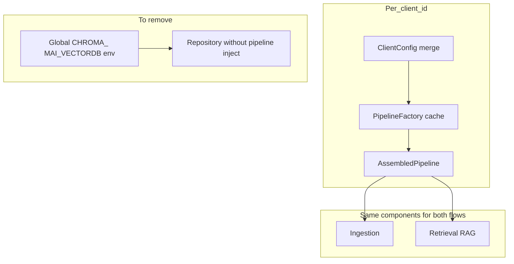

> **Opening this plan:** Use this file under your repo (path below). If Cursor shows **Unable to resolve resource** for a link like `C:\Users\...\ .cursor\plans\tenant-isolated_pipeline_config_e8f0a33e.plan.md`, that is a known limitation for **user-folder** plan URIs — use the workspace copy instead.

**Workspace path:** `.cursor/plans/tenant-isolated_pipeline_config.md`

# Tenant-isolated pipeline configuration — final production plan

This document is the **single canonical rollout guide**. Follow **Steps 0–9** in order; each **Gate** is a release blocker for production.

## Executive summary

- **Source of truth:** Merged JSON — [`app/core/configs/default.json`](../../app/core/configs/default.json) + optional [`app/core/configs/{client_id}.json`](../../app/core/configs) via [`get_client_config`](../../app/core/config/client_config_resolver.py).
- **Runtime wiring:** [`pipeline_factory`](../../app/core/pipeline_factory.py) → **cached `AssembledPipeline` per `client_id`**.
- **Ingest + retrieve:** **Same pipeline object** (vectordb, collection, embedder, LLM for RAG) — no separate env-built stack per tenant.
- **`.env`:** **Minimal** — DB, JWT/CORS, flags, tenant enforcement, **secret values** for `api_key_env` names; not per-tenant `CHROMA_PATH` / `MAI_VECTORDB` after migration.
- **Legacy:** [`ENABLE_LEGACY_ENV_FALLBACK`](../../app/retrieval/components.py) → set **false** in prod after all gates pass.

## Problem statement (today)

- **Works:** Authoritative path in [`retrieve_api.py`](../../app/api/v2/retrieve_api.py) injects `_pipe.vectordb` when config resolves.
- **Leaks:** [`RetrievalRepository._get_vectordb`](../../app/retrieval/repository.py), [`_build_config_from_env`](../../app/services/ingestion/ingestion_service_v2.py), [`rag_config_api._apply_vectordb_type`](../../app/api/v2/rag_config_api.py), [`ingestion_health`](../../app/api/v2/ingestion_health.py), [`chroma_search_service`](../../app/services/retrieval/chroma_search_service.py), [`classification_service`](../../app/services/classification/classification_service.py) read **process-wide** env → changing `.env` affects all tenants that hit those paths.
- **Risk:** Default **`ENABLE_LEGACY_ENV_FALLBACK=true`** masks broken tenant JSON by falling back to env.

## Invariants (do not violate in implementation)

1. **Parity:** Same `AssembledPipeline` for **ingestion**, **retrieve**, and **workers** for a given `client_id`. Query embeddings use **`pipeline.embedder`**, not an ad-hoc env embedder.
2. **One cache:** Reuse factory cache — avoid a second long-lived vectordb client per tenant per request.
3. **Secrets:** JSON holds **`api_key_env` names only**; values from env/vault.
4. **Config edits:** After on-disk JSON changes, **`pipeline_factory.invalidate(client_id)`** or restart (per existing patterns).
5. **`.env`:** Narrow to global bootstrap + secrets; tenant **paths / backends / collections** live in JSON.

## Real-time rollout checklist (Steps 0–9)

### Step 0 — Preconditions and data

- Every production `client_id` resolves in **staging**: `get_client_config` / alignment API succeeds.
- **Snapshot** `.env`, all `app/core/configs/*.json`, worker env.
- **Data:** Ensure [`default.json`](../../app/core/configs/default.json) reflects former global vector defaults; per-tenant overlays set **distinct** `persist_directory` (or remote `host`) and **`collection`** where needed. **Chroma:** satisfy [`ChromaConfig`](../../app/core/config/client_config_schema.py) (local path XOR remote host).

**Gate:** Staging-only deploy branch; no prod change yet.

### Step 1 — Inventory (read-only)

- Complete **inventory-legacy-env** (spreadsheet: file, symbol, tenant-safe?).

**Gate:** Zero unlisted `CHROMA_*` / `MAI_VECTORDB` / `QDRANT_*` callers.

### Step 2 — Observability

- Structured logs (and optional metrics) when `resolve_config_or_fail` → `legacy_env_fallback` (`client_id`, error class/message — no secrets).

**Gate:** Forced bad config in staging produces visible log line every time.

### Step 3 — Single pipeline entry

- Implement **`get_pipeline_for_client(client_id)`** → cached **`AssembledPipeline`** (same as ingest `_get_pipeline`). All retrieve/repo injection uses **`.vectordb`** + **`collection`** from this object; embed paths use **`.embedder`**.

**Gate:** Same **`config_fingerprint`** (or component id tuple) on **one ingest** and **one retrieve** for the same `client_id` in staging.

### Step 4 — Wire every tenant entry point

- Replace naked `RetrievalRepository(db_session=db)` with injection from Step 3.
- **[`app/worker/tasks.py`](../../app/worker/tasks.py)** and async ingest: **identical** `client_id` → **same pipeline** as API.

**Gate:** Two tenants, different JSON paths: **ingest + retrieve + worker** smoke per tenant; known chunk retrievable; no cross-tenant bleed.

### Step 5 — Stragglers

- [`ingestion_health`](../../app/api/v2/ingestion_health.py), [`chroma_search_service`](../../app/services/retrieval/chroma_search_service.py), [`classification_service`](../../app/services/classification/classification_service.py): tenant-scoped `ClientConfig` or injected `BaseVectorDB`.
- [`rag_config_api`](../../app/api/v2/rag_config_api.py): defaults from **merged default dict**, not `os.getenv` for paths.

**Gate:** Health for tenant A stable when process env changes; still reflects A’s JSON.

### Step 6 — Legacy builder

- [`_build_config_from_env`](../../app/services/ingestion/ingestion_service_v2.py): dev-only or no `client_id`; log when used.

**Gate:** Grep: no silent env-builder for known tenants in prod paths.

### Step 7 — Admin + docs

- [`settings/page.tsx`](../../app/frontend-admin/app/settings/page.tsx): **Deployment/secrets** vs **per-tenant pipeline** (JSON / pipeline builder). Publish **minimal `.env` template** (no `CHROMA_PATH` for multi-tenant ops).

**Gate:** New operator configures tenant paths **only** via JSON/UI.

### Step 8 — Flag rollout

- Staging: **`ENABLE_LEGACY_ENV_FALLBACK=false`**; fix tenants until clean.
- Prod: flip only after Steps 4–6 gates pass for **all** `client_id`s.

**Rollback:** `ENABLE_LEGACY_ENV_FALLBACK=true` + redeploy previous build; document one-liner runbook.

### Step 9 — Automated regression

- Two tenants, different `persist_directory`: distinct vectordb instances; **same fingerprint** ingest vs retrieve per tenant.
- Optional: env-only `CHROMA_PATH` change does **not** alter tenant with explicit JSON path (once legacy removed).

## Pitfalls (review before merge)

- **Embedder mismatch** ingest vs retrieve → zero recall / silent drift.
- **API vs worker** different config → split-brain.
- **Double truth** env + JSON for same tenant → wrong store.
- **Secrets in JSON** → never commit values.
- **`default` tenant** legacy `business_id` null — test **default** and **non-default** separately.

## Success criteria (production)

- Per tenant: **one** pipeline stack; **ingest + retrieve + worker** share it; telemetry/fingerprint aligns.
- `.env` **CHROMA_PATH** / **MAI_VECTORDB** changes do **not** override tenant with explicit JSON.
- Dashboards show **vectordb + embedder** identity **per selected tenant** from config.

## Constraints (preserve)

- Do not break [`get_client_config`](../../app/core/config/client_config_resolver.py) merge/discovery semantics.
- Do not store API key **values** in tenant JSON.
