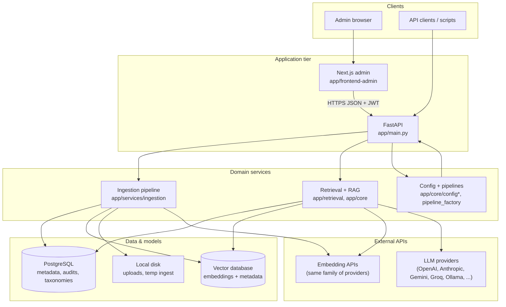
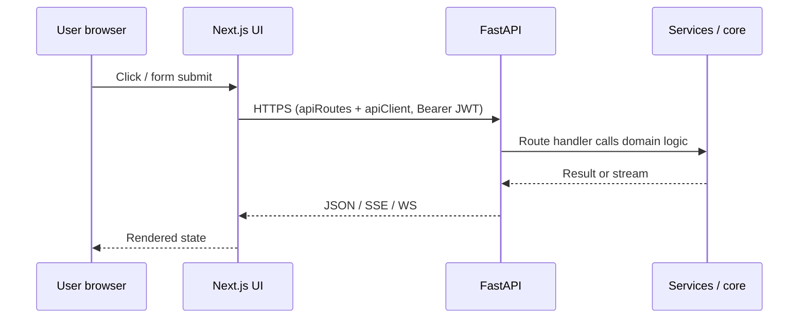

# Marketing Advantage AI — Architecture & Project Guide

**Audience:** developers and operators new to the codebase  
**Companion:** product README at [`README.md`](../README.md); deep ingestion diagram in [`ARCHITECTURE.md`](../ARCHITECTURE.md)

This document is a **single place** to understand how the system is structured, how data moves, and where to change behavior. It is suitable for **export to PDF** (see § [Exporting to PDF](#exporting-to-pdf)).

---

## Table of contents

1. [What this system does](#1-what-this-system-does)  
2. [High-level architecture](#2-high-level-architecture)  
3. [Runtime components](#3-runtime-components)  
4. [Request and data flows](#4-request-and-data-flows)  
5. [Repository map (where code lives)](#5-repository-map-where-code-lives)  
6. [Data stores](#6-data-stores)  
7. [Configuration layers](#7-configuration-layers)  
8. [Frontend admin (Next.js)](#8-frontend-admin-nextjs)  
9. [Operational paths](#9-operational-paths-workers-health)  
10. [Further reading](#10-further-reading)  
11. [Exporting to PDF](#exporting-to-pdf)

---

## 1. What this system does

**Marketing Advantage AI** is a **retrieval-augmented generation (RAG)** platform:

- **Ingest** documents and media (PDF, Office, CSV, web, RSS, optional audio/video).
- **Parse and chunk** content; **deduplicate** across layers.
- **Embed** chunks with a pluggable embedder (OpenAI, local Ollama, Hugging Face, etc.).
- **Store** metadata in **PostgreSQL** and vectors in a **pluggable vector database** (Chroma, Pinecone, Qdrant, Milvus, Redis vector, Weaviate, etc.).
- **Retrieve** relevant chunks at query time, optionally **rerank**, then **generate** answers with an LLM.

An **admin UI** (Next.js) talks to **FastAPI** backends to manage ingestion, settings, multi-tenant configs, and RAG chat/debug views.

---

## 2. High-level architecture

### 2.1 System context



### 2.2 Layered view (beginner mental model)

| Layer | Role | Typical folders |
|--------|------|-----------------|
| **Presentation** | Screens, forms, chat | `app/frontend-admin/` |
| **API** | Auth, validation, HTTP mapping | `app/api/v2/`, `app/auth/` |
| **Application services** | Use-cases: ingest, classify, audit | `app/services/*` |
| **Core engines** | Pipelines, embedders, LLMs, vectordb adapters | `app/core/*`, `app/ai/*` |
| **Data access** | ORM models and DB session | `app/db/*` |
| **Infrastructure** | Workers, brokers, migrations | `app/worker/`, `alembic/` |

---

## 3. Runtime components

### 3.1 Backend entrypoint

- **`app/main.py`** — Creates the FastAPI application, attaches middleware (CORS, request IDs, optional rate limiting), registers **all HTTP routers** under `app/api/v2/`, and runs startup/shutdown hooks (e.g., background validation schedulers, optional Sentry, optional `uvloop` on Linux/macOS).

### 3.2 API surface (canonical locations)

REST and WebSocket handlers live under **`app/api/v2/`**. Examples:

| Area | Illustrative modules |
|------|----------------------|
| Auth | `auth_api.py` |
| Ingestion | `ingestion_api_v2.py`, `ingestion_admin_api.py`, `ingestion_ws_api.py` |
| RAG / retrieve | `rag_api.py`, `retrieve_api.py`, `retrieve_chat_api.py` |
| Configuration | `config_api.py`, `rag_config_api.py`, template APIs |
| Admin / audit | `admin_*`, `ingestion_audit_api.py` |
| Health / integrity | `ingestion_health.py`, `ingestion_integrity_api.py`, `ingestion_sync_api.py` |

*(Exact feature set evolves; treat this table as a map, not an exhaustive endpoint list.)*

### 3.3 Core pipeline assembly

- **`app/core/pipeline_factory.py`** — Builds **tenant-aware** ingestion/RAG pipeline objects from resolved configuration.
- **`app/core/rag_pipeline.py`** — Orchestrates RAG graph execution (retrieve → optionally rerank/post-process → generate).
- **`app/core/config/`** — Schema, resolution, drift/diff helpers, runtime wiring (`client_config_schema.py`, `client_config_resolver.py`, `pipeline_runtime.py`, etc.).
- **`app/core/vectordb/`** — Vendor adapters (Chroma, Pinecone, Qdrant, Milvus, Redis, Weaviate, …).
- **`app/core/embedders/`**, **`app/core/llms/`**, **`app/core/rerankers/`** — Provider implementations + registration.

### 3.4 Retrieval subsystem

- **`app/retrieval/`** — Policies, orchestration, repository-style access to vector search, scoring, trust heuristics, and explanation helpers.
- **`app/services/retrieval/`** — Query embedding helpers and store-specific search glue where needed.

### 3.5 Ingestion subsystem

- **`app/services/ingestion/ingestion_service_v2.py`** — Central coordinator: parse → chunk → dedupe → persist → embed → upsert to vector DB.
- **Parsers** — `pdf_parser_v2.py`, `docx_parser_v2.py`, `csv_parser_v2.py`, etc., selected via `parsers_router_v2.py`.
- **Chunkers / segmenters** — Multiple strategies (overlap, structure-aware, optional accelerated paths).
- **Deduplication** — `deduplication_engine_v2.py` and related policy across hash / semantic / governance layers.
- **Optional async** — `app/worker/` (Celery) pushes heavy work to a broker-backed queue when enabled.

---

## 4. Request and data flows

### 4.1 Admin UI → API (generic)



### 4.2 Ingestion: upload to vectors + metadata

Conceptual path (inline vs queued is configuration-dependent; see [`ARCHITECTURE.md`](../ARCHITECTURE.md) for the broker diagram):

1. **Browser** uploads via admin UI → **`lib/apiRoutes.ts`** / **`lib/apiClient.ts`**.
2. **FastAPI** `ingestion_api_v2` (or related) validates auth, stores file on **disk** (commonly under `static/uploads/` or configured paths), creates **`ingested_file`** row in **PostgreSQL**.
3. **Worker or inline path** runs **`IngestionServiceV2`**: parse, chunk, dedupe, write **`ingested_content`** (and related) to PostgreSQL.
4. **Embedder** produces vectors; **vector DB adapter** upserts into the configured **vector store**.
5. **WebSocket** (`ingestion_ws_api`) or polling can surface progress to the UI.

### 4.3 RAG: question to answer

1. UI or API client sends query to **`retrieve_api`**, **`retrieve_chat_api`**, or **`rag_api`**.
2. **Query embedding** uses the tenant-configured embedder.
3. **Vector search** (often hybrid with sparse/BM25 pieces in `app/core/search/`) returns candidate chunks.
4. Optional **reranking** (`app/core/rerankers/`, connectors).
5. **LLM** generates a grounded answer using retrieved context (`app/core/llms/`).
6. Response returns to client; audits/metrics may be written depending on route.

---

## 5. Repository map (where code lives)

The table below is a **practical index**. It is not a one-line-per-data-file inventory (uploads, logs, and local DB shards are summarized).

| Path | Responsibility |
|------|----------------|
| `app/main.py` | FastAPI app assembly, router registration, lifecycle |
| `app/api/v2/` | HTTP/WebSocket endpoints |
| `app/auth/` | JWT dependencies, guards, token helpers |
| `app/middleware/` | Cross-cutting HTTP concerns |
| `app/db/` | SQLAlchemy models, session, SQL reference scripts |
| `app/services/ingestion/` | Ingestion pipeline implementation |
| `app/services/classification/` | Taxonomy / classification |
| `app/services/validation/` | Background validation / conflict / temporal workers |
| `app/services/security/` | Ingestion security and audit helpers |
| `app/services/kafka/` | Kafka integration |
| `app/services/admin/` | Admin-side registries (e.g., client configs) |
| `app/core/` | Pipeline factory, embedders, LLMs, vectordb, chunking, caching, connectors |
| `app/ai/` | Contracts, catalogs, AI connectors, evaluation, recommendations |
| `app/retrieval/` | Retrieval policies, orchestration, repository patterns |
| `app/worker/` | Celery app and tasks |
| `app/utils/` | Logging, sanitization, tenant helpers, text cleanup |
| `app/frontend-admin/` | Next.js admin UI (pages, components, hooks, API map) |
| `app/config/` | Legacy / global ingestion-related configuration surface |
| `alembic/` | Database migrations |
| `docs/` | Architecture audits, scalability notes, **this guide** |
| `tests/` | Pytest suites (including tenant isolation) |
| `scripts/` | Developer maintenance utilities |
| `static/uploads/` | Stored uploads (large; not all belong in git in production) |
| `root *.py` | Backfill, diagnostics, CLI experiments |

**Parallel “policy / TAP” track:** `core/policy/` and `core/tap/` implement an alternate typed adapter/engine path; some deployments may import these selectively.

---

## 6. Data stores

| Store | Holds | Accessed via |
|--------|--------|----------------|
| **PostgreSQL** | Ingested files/chunks, taxonomies, audit logs, operational metadata | SQLAlchemy (`app/db/session_v2.py`, models under `app/db/models/`) |
| **Vector database** | Embeddings + vector-side metadata | `app/core/vectordb/*` adapters |
| **Object/disk storage** | Raw uploads, temp ingest artifacts | File paths from ingestion settings / upload handlers |
| **Broker (optional)** | Task queue for Celery | Redis/Kafka/etc. via `app/worker/` |
| **Cache (optional)** | Embedding/result caches | `app/core/cache/*` (memory or Redis-backed patterns) |

---

## 7. Configuration layers and Effective Tenant Runtime (SSOT)

Configuration is split **on purpose** between platform, tenant pipeline, and legacy toggles. **Start here:** [`docs/configuration_layout.md`](configuration_layout.md).

### 7.1 Layer summary

| Layer | Location | Owns |
|--------|----------|------|
| **Environment / platform** | `app/core/settings.py`, `.env` | Brokers, DB URLs, global feature flags |
| **Tenant pipeline JSON** | `app/core/configs/{client_id}.json` | VectorDB, embedder, LLM, reranker, retrieval, ingestion |
| **Prompt Library** | `app/core/configs/prompts/*.json` | Generation `system_instructions` (canonical text) |
| **Pipeline templates** | `app/core/configs/pipeline_templates/` | Starter patches for admin Pipeline Builder |
| **Catalogs** | `app/ai/catalog/*.yaml` | Discovery lists for admin dropdowns (not tenant defaults) |

When changing behavior, decide **which layer** owns the knob before editing files.

### 7.2 EffectiveTenantRuntime — server SSOT bridge

**Problem:** Tenant JSON, runtime coercion (e.g. local Ollama stack), and admin UIs can drift (wrong LLM in chat, “None” reranker but `flashrank` ran, inline `prompt.template` vs library id).

**Solution:** `build_effective_tenant_runtime(client_id)` in `app/core/config/effective_tenant_runtime.py` computes a **read-only** `EffectiveTenantRuntime` DTO (`app/core/config/client_config_schema.py`) that merges:

- Resolved LLM / embedder / retrieval from `resolve_runtime_components`
- Reranker plugin + coercion from `resolve_reranker_runtime` / `reranker_config_coercion.py`
- Prompt resolution from `app/core/prompts/ssot.py` (`resolve_prompt_ssot`)

Results are cached per `(client_id, config_fingerprint)` with TTL and invalidated on pipeline PUT/PATCH in `rag_config_api.py`.

**HTTP (no new router):**

```http
GET /api/v2/models/runtime?client_id={tenant}
```

Returns configured vs effective fields, `warnings[]`, and `retrieval.prompt_ssot` (effective library id, source, preview capped at 240 chars). Admin UI should hydrate session controls from this endpoint, not from global `/models/llm` defaults alone.

### 7.3 Prompt generation SSOT (library-first)

| Priority | Source | Field |
|----------|--------|--------|
| 1 (canonical) | Prompt Library JSON | `retrieval.prompt_template_id` → `app/core/configs/prompts/{id}.json` |
| 2 | Preset map | `prompt.prompt_type` → library id via `PROMPT_PRESET_LIBRARY` in `ssot.py` |
| 3 (legacy, warned) | Inline string | `prompt.template` — emits runtime warning; **library id wins** when both are set |
| Last resort | Immutable fallback | `_EMERGENCY_FALLBACK_PROMPT` in `ssot.py` if library file missing (CRITICAL log) |

**Wired for generation:** `retrieve_chat_api.py`, `rag_api.py`, `pipeline_factory` PromptNode. On save, `sync_prompt_ssot_to_config` maps unset `prompt_template_id` from preset keys.

**Admin rule:** Prefer `retrieval.prompt_template_id` (e.g. `querysystem`). Remove large inline `prompt.template` blocks from tenant JSON once a library id is set.

**Persist rule (new tenants):** `enforce_library_first_prompt_persist()` runs on every pipeline save and new-tenant seed. It sets `prompt.template` to `null`, maps presets → library ids, and rejects inline `template` / `custom_template` from API writes. Canonical blueprint: `default.json` uses `retrieval.prompt_template_id: "preset-rag-context"` with no inline template body.

### 7.4 Reranker coercion rules (summary)

On **local Ollama stack** (`embedder.type=ollama` and `llm.single.type=ollama`), cloud or HF reranker types stored in JSON are coerced to **FlashRank** (`local_stack_boundary`). Type/model mismatches (e.g. cross-encoder type with GPT model id) are normalized before plugin build. Coercion is audited via structured logs in `reranker_config_coercion.py` when fallback applies.

Runtime exposes `reranker.configured_type` vs `reranker.effective_plugin` and `coercion_applied` / `coercion_reason` for UI banners.

### 7.5 Admin UI contract

- **Chat / retrieve session:** `GET /models/runtime` on debounced `clientId`; send `reranker: "none"` explicitly when user selects None.
- **Reranking settings:** Show `RuntimeWarningBanner` when `warnings` include dual prompt sources.
- **Pipeline Builder:** Display `Effective template: {effective_template_id}`; template gallery shows client-side coercion preview before apply on local stacks.

See also [`docs/observability-rag-chat-trace.md`](observability-rag-chat-trace.md) for per-turn `debug_info` (`reranker_used`, `prompt_template_*`).

---

## 8. Frontend admin (Next.js)

| Area | Role |
|------|------|
| `app/frontend-admin/app/` | Routes and pages (dashboard, ingestion, settings, retrieve/chat) |
| `app/frontend-admin/lib/apiRoutes.ts` | **Central map** of UI paths to backend routes |
| `app/frontend-admin/lib/apiClient.ts` | HTTP client (base URL, auth header) |
| `app/frontend-admin/contexts/TenantContext.tsx` | Current tenant / client id for multi-tenant admin |
| `app/frontend-admin/middleware.ts` | Route protection / redirects |

See [`app/frontend-admin/README.md`](../app/frontend-admin/README.md) for UI-specific run instructions.

---

## 9. Operational paths (workers, health)

- **Celery** — When enabled, `app/worker/tasks.py` runs ingestion and related background jobs; broker configured in `app/worker/broker_config.py`.
- **Health endpoints** — `ingestion_health.py` and general `/health` style routes in `main.py` support probes and ops dashboards.
- **Integrity / sync** — `ingestion_integrity_api.py`, `ingestion_sync_api.py` help repair mismatches between PostgreSQL and the vector index.
- **Migrations** — Apply with Alembic before relying on new columns (see `alembic/versions/`).

---

## 10. Further reading

| Document | Topic |
|----------|--------|
| [`README.md`](../README.md) | Quick start, doc index |
| [`ARCHITECTURE.md`](../ARCHITECTURE.md) | Ingestion pipeline diagram (upload → broker → worker → vectordb) |
| [`docs/diagrams/README.md`](diagrams/README.md) | **Data-flow diagram with file names** (HTML → print PDF; CSV for Excel) |
| [`docs/configuration_layout.md`](configuration_layout.md) | Where each kind of config lives |
| [`app/core/config/README.md`](../app/core/config/README.md) | Tenant pipeline schema & resolution |
| [`app/config/README.md`](../app/config/README.md) | Legacy / multimodal ingestion toggles |
| [`docs/SCALABILITY_PLAN.md`](SCALABILITY_PLAN.md) | Scale-out considerations |
| [`runtime_parity_audit.md`](../runtime_parity_audit.md) | Runtime parity notes (if present in your branch) |

---

## 11. Exporting to PDF

This file is plain **Markdown**. You can turn it into a PDF in any of these ways:

1. **VS Code / Cursor** — Open this file → **Print** → choose **Microsoft Print to PDF** (or similar).
2. **Pandoc** (if installed) — from the repo root:
   ```bash
   pandoc docs/MarketingAdvantage_AI_Architecture_Guide.md -o docs/MarketingAdvantage_AI_Architecture_Guide.pdf
   ```
   For better PDF styling you can add a template or `--pdf-engine=xelatex` depending on your setup.
3. **GitHub / GitLab** — Render Markdown in the web UI and print to PDF from the browser.

**Note:** Mermaid diagrams render in many Markdown viewers (GitHub, some IDEs). Static PDF export may require a Mermaid-capable renderer (Pandoc with filters, or paste diagrams into a Mermaid Live editor and export SVG/PNG into a Word/Google Doc). If your PDF path does not render Mermaid, the **text in §2–4** still describes the same architecture.

---

*Document generated for onboarding and architecture reviews. Update this file when major boundaries move (new routers, new stores, new config layers).*
