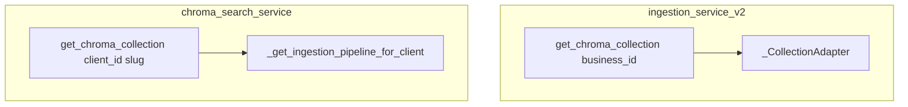

# Tenant isolation — Gates 1–4 and Pipeline Builder migration

This document describes the production rollout for **Gate 4** (classification + Chroma search services) and **Pipeline Builder** Chroma path alignment. It complements [`.cursor/plans/tenant-isolated_pipeline_config.md`](../.cursor/plans/tenant-isolated_pipeline_config.md).

## Summary of changes

| Gate | Area | Behavior |
|------|------|----------|
| **1** | `BaseVectorDB._enforce_tenant_filter` | `tenant_id=None` raises `TenantFilterViolation` when tenant isolation is enabled |
| **2** | `TENANT_ENFORCEMENT_MODE` | Default **`strict`**; invalid env values default to **strict** |
| **3** | `ingestion_service_v2._CollectionAdapter` | Requires explicit `collection_name` from Client JSON — no `MAI_COLLECTION` env fallback |
| **4** | Classification + Chroma search | No env singletons; all entrypoints require `client_id` (tenant slug) |
| **UI** | Pipeline Builder Step 3/7 | Local Chroma: persist directory + collection PATCH on Apply |

## Gate 4 — Backend API changes

### Required `client_id` (tenant slug)

| Function | Module | Notes |
|----------|--------|-------|
| `ClassificationService.classify_chunk(..., client_id: str)` | `classification_service.py` | No env fallback VectorDB |
| `ClassificationRouter.classify_file` | `classification_router.py` | Resolves slug from `IngestedFileV2.business_id` |
| `get_chroma_collection(client_id: str)` | `chroma_search_service.py` | Not the ingestion同名 function |
| `semantic_search(..., client_id: str)` | `chroma_search_service.py` | Uses `BaseVectorDB.search` + tenant filter |
| `health_check(client_id: str)` | `chroma_search_service.py` | Per-tenant stats |

### UUID → slug (classification)

`classify_file` loads `IngestedFileV2` by `file_id`, requires `business_id`, then calls `_resolve_client_id_for_config_lookup(str(business_id))` before `classify_chunk`.

### Name collision: two `get_chroma_collection`

- **Ingestion:** `get_chroma_collection(business_id=...)` → adapter for admin/sync upserts.
- **Retrieval helper:** `chroma_search_service.get_chroma_collection(client_id)` → tenant slug only.

Do not import one expecting the other’s signature.

### `chroma_search.py`

Legacy `ChromaSearch` singleton removed. Module re-exports tenant-scoped functions from `chroma_search_service`.

### `retrieve_cli.py`

Requires `--client-id <slug>` or `CLIENT_ID` env. Passes `tenant_id` and `storage_uuid` into `RetrievalRuntime.retrieve`.

## Pipeline Builder — new tenant Chroma path

1. Open **Settings → Pipeline Builder** with tenant selected in the navbar.
2. **Step 3 — Storage & Search:** choose **Chroma**.
3. Set **Chroma persist directory** (required), e.g. `./data/tenants/<clientId>`.
4. Optionally set **Collection name** (default `ingested_content`).
5. **Step 7 — Apply:** PATCH includes `vectordb_type`, `chroma_persist_directory`, and `collection` in one request.

Forbidden shared paths (UI validation): `./pluggable_db`, `./chroma_db`.

Cloud vector DBs (Qdrant, Pinecone, etc.) do not show local path fields.

## Ops / dev

- **Strict enforcement:** Missing `client_id` on API routes → 4xx via `validate_tenant_id_strict`.
- **Dev-only bypass:** `TENANT_ENFORCEMENT_MODE=off` (not for production).
- **Health:** `health_check(client_id)` must receive tenant slug.
- **Tests:** `pytest tests/tenant_isolation/ tests/test_classification_chroma_tenant.py -v`

## Residual risks (out of scope)

- Admin UI has no RBAC — any operator can switch tenants.
- `taxonomy_loader.py` still uses env Chroma for global taxonomy index.
- `retrieval/repository.py` and `retrieval/components.py` may still read `MAI_COLLECTION` / `CHROMA_PATH` on lazy init.
- `ingestion_sync_api.py` calls `get_chroma_collection()` without explicit tenant — follow-up ticket.
- Shared prompt library files under `app/core/configs/prompts/`.

## Rollback

1. Revert PR.
2. Set `TENANT_ENFORCEMENT_MODE=warn` only if you must run legacy scripts without `client_id` (temporary).
3. Restore per-tenant `chroma.persist_directory` in Client JSON if paths were migrated.
